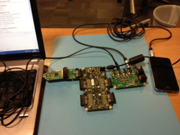

I2S Master Loopback Demonstration Application
=============================================

.. toctree::

app_i2s_master_example_skc_l2 Quick Start Guide
-----------------------------------------------

This application uses the I2S master module to demonstrate a simple audio loopback in software and offers a simple introduction to implementing or prototyping audio processing on an XCore processor.It is designed to run on the XMOS L2 Slicekit Core Board (XP-SKC-L2) in conjuction with an Audio Slice Card (XA-SK-AUDIO).

The functionality of the program is a follows:

    * Setup the audio hardware on the board as required, this includes Master clock selection and CODEC setup (using module_i2c_master)
    * Provide a digital loopback from all ADC inputs to all DAC outputs (that is, ADC1 -> DAC1). A ``processing()`` function accepts ADC data from the I2S master component and outputs the back to the I2S component as DAC data. 

Hardware Setup
++++++++++++++

To setup the hardware:

    #. Connect the XA-SK-AUDIO slice card to the XP-SKC-L2 Slicekit core board using the connector marked with the ``CIRCLE``. 
    #. Connect the XTAG-2 USB debug adaptor to the XP-SKC-L2 Slicekit core board (via the supplied adaptor board)
    #. Connect the XTAG-2 to host PC (as USB extension cable can be used if desired)
    #. Connect the power supply to the XP-SKC-L2 Slicekit Core board
    #. Attach an audio source (such as an MP3 player) to input 1/2 (marked ``In 1-2``) via the 3.5mm audio jack.
    #. Attach speakers or headphones to output 1/2 via the 3.5mm audio jack (marked ``Out 1-2``)

   Hardware Setup for XA-SK-AUDIO demo (I2S master)

Import and Build the Application
++++++++++++++++++++++++++++++++

   #. Open xTimeComposer and open the edit perspective (Window->Open Perspective->XMOS Edit).
   #. Locate the ``I2S Master Slicekit Loopback Demo`` item in the xSOFTip pane on the bottom left of the window and drag it into the Project Explorer window in the xTimeComposer. This will also cause the modules on which this application depends (in this case, module_i2c_master) to be imported as well. 
   #. Click on the ``app_slicekit_i2s_master_demo`` item in the Explorer pane then click on the build icon (hammer) in xTimeComposer. Check the console window to verify that the application has built successfully.

Note that the Developer Column in the xTimeComposer on the right hand side of your screen provides information on the xSOFTip components you are using. Select the module_i2c_master component in the Project Explorer, and you will see its description together with API documentation. Having done this, click the `back` icon until you return to this quickstart guide within the Developer Column.

For help in using xTimeComposer, try the xTimeComposer tutorial (See Help->Tutorials in xTIMEcomposer).

Run the Application
+++++++++++++++++++

Now that the application has been compiled, the next step is to run it on the Slicekit Core Board using the tools to load the application over JTAG (via the XTAG2 and Xtag Adaptor card) into the xCORE multicore microcontroller.

   #. Click on the ``Run`` icon (the white arrow in the green circle).   A dialog will appear asking which device to connect to. Select ``XMOS XTAG2``.
   #. The application will now be running and providing a loopback functionality. Listen for the output via headphones or speakers. If the audio source is changed to input 3/4, the output will be available on output 3/4. There is no need to restart the application, just switch the audio connections over.
   #. Terminating the application will cause the loopback to stop.

Next Steps
++++++++++

   #. Take a look at the various Audio DSP and processing components provided within the xSOFTip suite including filter/biquad, delay lines, non-linear gain and reverb.
   #. Review the XMOS USB audio reference designs, available at xmos.com (See ``Resources -> xKITS Resources -> reference Designs``). 

